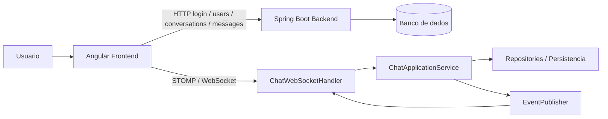
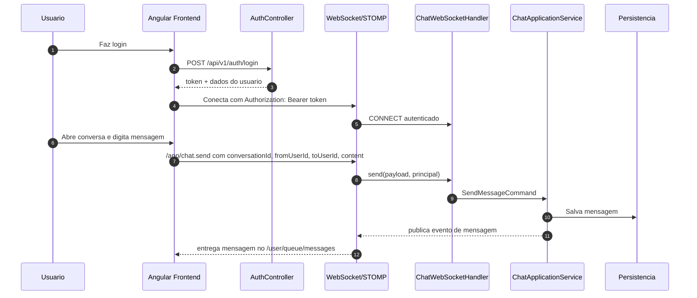
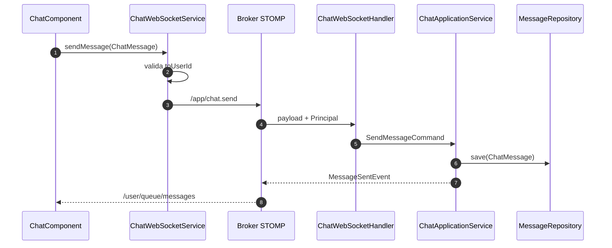
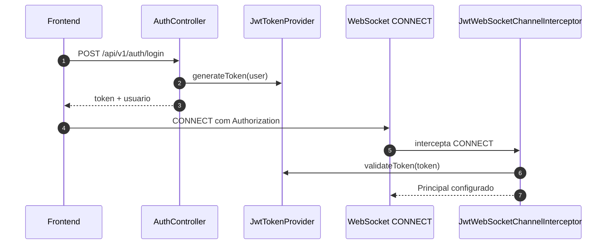

# Documento de estudo: fluxo da aplicacao de chat

## Objetivo
Este documento explica o fluxo completo da aplicacao, do login ate o envio/recebimento de mensagens, mostrando como backend e front se conversam.

Tambem registra as correcoes feitas para resolver:

- UUID vazio ao enviar mensagem;
- `toUserId` ausente no payload do WebSocket;
- nomes aparecendo como hash/UUID nas notificacoes e na conversa;
- historico da conversa invertido ao reabrir o chat.

## Visao geral
A aplicacao tem tres pilares principais:

1. Autenticacao.
2. Conversas e mensagens.
3. Tempo real via WebSocket.

O front usa HTTP para carregar dados iniciais e STOMP/WebSocket para eventos em tempo real.

## Arquitetura em alto nivel

## Fluxo principal da aplicacao

## Fluxos por funcionalidade

### 1. Login
Arquivo principal: [AuthController.java](websocket-back/src/main/java/com/seuprojeto/chat/interfaces/rest/auth/AuthController.java)

Fluxo:

1. O front envia `username` e `password` para `/api/v1/auth/login`.
2. O backend valida credenciais em `AuthApplicationService`.
3. O token JWT e o usuario logado retornam para o front.
4. O front salva a sessao em local storage.

Importante:

- o JWT carrega o `userId` no `subject`;
- esse `userId` vira a identidade usada no HTTP e no WebSocket.

### 2. Lista de usuarios online
Arquivo principal: [UserController.java](websocket-back/src/main/java/com/seuprojeto/chat/interfaces/rest/user/UserController.java)

Fluxo:

1. O front consulta `/api/v1/users/online` periodicamente.
2. O backend devolve os usuarios online.
3. O front usa isso para montar a lobby e resolver nomes exibidos.

### 3. Abrir conversa
Fluxo no front:

1. O usuario clica em um contato na lobby.
2. O front navega para `/chat/:userId`.
3. A tela de chat define o `activeUserId`.
4. O front chama `ensureConversation(userId)`.
5. O backend cria ou reaproveita a conversa.
6. O historico e carregado via HTTP.

### 4. Enviar mensagem
Arquivo principal do front: [chat-ws.service.ts](websocket-front/chat-app/src/app/core/services/chat-ws.service.ts)

Fluxo:

1. A tela monta um `ChatMessage` local com `fromUserId`, `toUserId` e `content`.
2. O service garante que `toUserId` existe antes de publicar.
3. O service envia `/app/chat.send` com `conversationId`, `fromUserId`, `toUserId`, `content`, `sentAt` e `messageId`.
4. O backend valida o principal autenticado.
5. O caso de uso grava a mensagem.
6. O backend publica o evento para o destinatario.

### 5. Receber mensagem
Fluxo:

1. O destinatario esta inscrito em `/user/queue/messages`.
2. O front recebe o frame.
3. O service mapeia a mensagem para o chat correto.
4. A UI atualiza a conversa.
5. Se o usuario nao estiver olhando a conversa, a notificacao usa o nome resolvido do remetente.

### 6. Notificacoes
Arquivo principal: [app.ts](websocket-front/chat-app/src/app/app.ts)

Fluxo:

1. O stream de eventos do chat recebe um `MESSAGE` ou `CHAT_REQUEST`.
2. O front resolve o nome do usuario por uma fonte central.
3. A notificacao mostra nome humano, nao `id` bruto.

### 7. Historico da conversa
Arquivo principal: [chat-ws.service.ts](websocket-front/chat-app/src/app/core/services/chat-ws.service.ts)

Fluxo:

1. O backend retorna o historico com paginação e ordem decrescente.
2. O front reordena por `timestamp` em ordem crescente.
3. Ao reabrir a conversa, as mensagens antigas aparecem primeiro e as novas ficam embaixo.

## Como o WebSocket foi autenticado

Arquivo: [JwtWebSocketChannelInterceptor.java](websocket-back/src/main/java/com/seuprojeto/chat/infrastructure/websocket/JwtWebSocketChannelInterceptor.java)

O problema original era que o socket podia entrar sem identidade valida. Para corrigir isso:

- o front envia o JWT no `connectHeaders`;
- o interceptor captura o `CONNECT`;
- o token e validado;
- o `Principal` do socket recebe o `userId` do JWT.

Sem isso, o backend acabava tentando converter string vazia em UUID.

## Estrutura de backend

### Camada REST

- [AuthController.java](websocket-back/src/main/java/com/seuprojeto/chat/interfaces/rest/auth/AuthController.java) cuida de login, refresh e logout.
- [UserController.java](websocket-back/src/main/java/com/seuprojeto/chat/interfaces/rest/user/UserController.java) expõe usuarios online e consulta por id.
- [ChatController.java](websocket-back/src/main/java/com/seuprojeto/chat/interfaces/rest/chat/ChatController.java) cuida de conversa, historico, envio HTTP e marcar mensagem como lida.

### Camada de aplicacao

- [AuthApplicationService.java](websocket-back/src/main/java/com/seuprojeto/chat/application/auth/AuthApplicationService.java) valida credenciais e emite JWT.
- [ChatApplicationService.java](websocket-back/src/main/java/com/seuprojeto/chat/application/chat/ChatApplicationService.java) cria conversas, salva mensagens e marca leitura.
- [UserStatusApplicationService.java](websocket-back/src/main/java/com/seuprojeto/chat/application/user/UserStatusApplicationService.java) lista e atualiza status online.

### Camada WebSocket

- [WebSocketConfig.java](websocket-back/src/main/java/com/seuprojeto/chat/infrastructure/websocket/WebSocketConfig.java) registra endpoint, broker e interceptor.
- [JwtWebSocketChannelInterceptor.java](websocket-back/src/main/java/com/seuprojeto/chat/infrastructure/websocket/JwtWebSocketChannelInterceptor.java) autentica o CONNECT.
- [ChatWebSocketHandler.java](websocket-back/src/main/java/com/seuprojeto/chat/infrastructure/websocket/ChatWebSocketHandler.java) recebe eventos STOMP.
- [WebSocketEventPublisher.java](websocket-back/src/main/java/com/seuprojeto/chat/infrastructure/websocket/WebSocketEventPublisher.java) publica eventos de dominio para os canais do socket.

## Estrutura do frontend

### Servicos centrais

- [auth.service.ts](websocket-front/chat-app/src/app/core/services/auth.service.ts) controla login, sessao e usuario corrente.
- [chat-ws.service.ts](websocket-front/chat-app/src/app/core/services/chat-ws.service.ts) faz o gateway entre UI, HTTP e WebSocket.
- [notification.service.ts](websocket-front/chat-app/src/app/core/services/notification.service.ts) exibe toast, notificacoes nativas e contadores de nao lidas.

### Telas principais

- [lobby.component.ts](websocket-front/chat-app/src/app/features/lobby/lobby.component.ts) mostra usuarios online e inicia conversa.
- [chat.component.ts](websocket-front/chat-app/src/app/features/chat/chat.component.ts) exibe mensagens, digitação e envio.
- [chat-header.component.ts](websocket-front/chat-app/src/app/features/chat/chat-header/chat-header.component.ts) mostra titulo, status e botao de voltar.
- [message-bubble.component.ts](websocket-front/chat-app/src/app/features/chat/message-bubble/message-bubble.component.ts) renderiza cada mensagem.

## Correcoes aplicadas neste fluxo

### Backend

- o socket passou a autenticar o `CONNECT` com JWT;
- o handler nao aceita `Principal` vazio;
- o caso de uso nao aceita `fromUserId` ou `toUserId` vazios.

### Frontend

- o payload STOMP de mensagem passou a levar `toUserId`;
- o envio e bloqueado se o destinatario nao existir;
- nomes passaram a ser resolvidos de forma central;
- notificacoes usam nome, nao hash;
- o titulo da conversa usa o nome resolvido;
- o historico e reordenado antes de renderizar.

## Diagrama do envio de mensagem

## Diagrama do login e autenticacao

## Validacoes executadas

- backend: `mvnw.cmd test`
- front: `npm run build`

## Pontos importantes para estudo

- O backend deve validar identidade mesmo quando o front tambem valida.
- O websocket precisa de autenticação propria; nao basta o HTTP.
- Nao use `id` cru para exibir nome de usuario na UI.
- Se a API devolve dados em ordem diferente da leitura desejada, o front pode normalizar antes de renderizar.
- Resolver nome em um unico lugar reduz bugs visuais em notificacoes, lista e cabecalho.

## Arquivos principais para revisar

Backend:

- [AuthController.java](websocket-back/src/main/java/com/seuprojeto/chat/interfaces/rest/auth/AuthController.java)
- [UserController.java](websocket-back/src/main/java/com/seuprojeto/chat/interfaces/rest/user/UserController.java)
- [ChatController.java](websocket-back/src/main/java/com/seuprojeto/chat/interfaces/rest/chat/ChatController.java)
- [AuthApplicationService.java](websocket-back/src/main/java/com/seuprojeto/chat/application/auth/AuthApplicationService.java)
- [ChatApplicationService.java](websocket-back/src/main/java/com/seuprojeto/chat/application/chat/ChatApplicationService.java)
- [WebSocketConfig.java](websocket-back/src/main/java/com/seuprojeto/chat/infrastructure/websocket/WebSocketConfig.java)
- [JwtWebSocketChannelInterceptor.java](websocket-back/src/main/java/com/seuprojeto/chat/infrastructure/websocket/JwtWebSocketChannelInterceptor.java)
- [ChatWebSocketHandler.java](websocket-back/src/main/java/com/seuprojeto/chat/infrastructure/websocket/ChatWebSocketHandler.java)

Frontend:

- [auth.service.ts](websocket-front/chat-app/src/app/core/services/auth.service.ts)
- [chat-ws.service.ts](websocket-front/chat-app/src/app/core/services/chat-ws.service.ts)
- [notification.service.ts](websocket-front/chat-app/src/app/core/services/notification.service.ts)
- [app.ts](websocket-front/chat-app/src/app/app.ts)
- [lobby.component.ts](websocket-front/chat-app/src/app/features/lobby/lobby.component.ts)
- [chat.component.ts](websocket-front/chat-app/src/app/features/chat/chat.component.ts)
